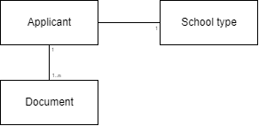

<left>

   **Tieto Education APIs**

Application API
</left>

 

Version 1.0.0

2025-02-20

# Technical Specification API
## Application API  

[comment]: # (Page break)

## **Table of Contents**

[**1 Introduction**](#introduction)

- [**1.1 Prerequisites**](#prerequisites) 

[**2 Supported school types**](#supported-school-types)

[**3 Application API**](#application-api)

- [**3.1 Domain model**](#dm) 

- [**3.2 Entities**](#entities)
  
  -   [**3.2.1 Applicant Document**](#applicant-document)
     
[**4 Services**](#services)

- [**4.1 Update Applicant Document Service**](#update-applicant-document-service) 

   

[comment]: # (Page break)

## **1 Introduction**

The Application API provides a service that makes it possible to update documents for applicants to the Edlevo application. The service in the Application API are accessed via URIs.

This document describes the following:

- What types of applicant documents that user can store via the Application API.
- How the information elements are structured

---

### **1.1 Prerequisites**

Before you can get access of the Application API, you must request a license key from TietoEvry. You should have basic knowlege on Swedish school system and W3C XML before you start using the API.

 

[comment]: # (Page break)

## 2 Supported school types

 

This API handles application documents for Adult School Types.

[comment]: # (Page break)

## 3 Application

 ### **3.1 Domain model**

This chapter describe the Application entities and their attributes.

### **3.2 Entities**

#### **3.2.1 Applicant Document** 

Attributes for applicant document attributes.

| Name                               | Description                             | Read-only |
| ---------------------------------- | --------------------------------------- | --------- |
| applicantid                        | SSN for the applicant                   | N         |
| schooltype                         | The school type for the applicant    Following types are defined <ul>KV (KomVux)</ul> <ul>SV (SärVux)</ul> <ul>SF (Svenska för invandrare)</ul> <ul>YH (Yrkeshögskola)</ul>      | N         |
| typeofdocument                     | Type of document to be stored   Following types are defined <ul>ApplicationAppendix</ul> <ul>IKE_In</ul> <ul>IKE_Out</ul> | N         |
| filename                           | Name of the file to be stored           | N         |
| filecontent                        | Content of the file as a Base64 encoded string | N         |

 

 

[comment]: # (Page break)

## 4 Services

All services are based on HTTP REST technology. "Get services" are using the method HTTP GET. "Update services" are using the method HTTP POST.

 

### **4.1 Update Applicant Document Service**

This service stores a document for an applicant.
The maximum size of a file is 22MB.

If Edlevo already contains a document for the person with the same school type, document type and file name, that document is overwritten by the file content in the request.

A successful storing of the document returns an HTTP 200 statuc code.

Any validation error of the input returns an HTTP 400 status code.

Other types of errors returns an HTTP 500 status code.

**Services :**

| Service| Description|
| ------ | ---------- |
|UpdateAdultApplicantDocument| Save a document for an adult applicant.|

 

