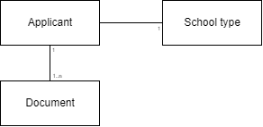

<left>

   **Edlevo APIs**

Application API
</left>

 

Version 2.0.0

2025-10-16

# Technical Specification API
## Application API

[comment]: # (Page break)

## **Table of Contents**

[**1 Introduction**](#introduction)

- [**1.1 Prerequisites**](#prerequisites)

- [**1.2 Endpoints**](#endpoints)

[**2 Supported school types**](#supported-school-types)

[**3 Applicant Document**](#applicant-document)

- [**3.1 Domain model**](#dm)

- [**3.2 Entities**](#entities)

  -   [**3.2.1 applicantdocument**](#applicantdocument)

[**4 Applications**](#applications)

- [**4.1 Domain model**](#applications-dm)

- [**4.2 Entities**](#applications-entities)

  -   [**4.2.1 applications**](#applications-entity)

  -   [**4.2.2 application**](#application-entity)

  -   [**4.2.2 appliedcoursesandpackages**](#appliedcoursesandpackages-entity)

  -   [**4.2.2 coursetype**](#coursetype-entity)

  -   [**4.2.2 coursepackagetype**](#coursepackagetype-entity)

[**5 Services**](#services)

- [**5.1 Update Applicant Document**](#update-applicant-document)

- [**5.2 Get Adult School Applications**](#get-adult-school-applications)

 

[comment]: # (Page break)

## **1 Introduction**

The Application API provides services that:
- makes it possible to update documents for applicants to the Edlevo application.
- makes it possible to fetch all applications made on or after the specified date for each corresponding school type.

The services in the Application API are accessed via URIs.

This document describes the following:

- What types of applicant documents that can be stored via the Application API.
- How the information elements are structured.

---

### **1.1 Prerequisites**

Before you can get access to the Application API, you must request a license key from Tietoevry. You should have basic knowledge of the Swedish school system and W3C XML before you start using the API.

 

### **1.2 Endpoints**

The Application API is always hosted in the Edlevo cloud environment. API url and path is:  
https://prodintegration-education.service.tieto.com/AdultApplication.Integration.Host/LES/Application/v2/Application/  
for our production environment and:  
https://utbintegration-education.service.tieto.com/AdultApplication.Integration.Host/LES/Application/v2/Application/  
for our test environment.

 

To call a service, append the service name to the appropriate path listed above, including any query parameters and your LicenseKey.

[comment]: # (Page break)

## 2 Supported school types

 

This API handles applications and application documents for Adult School Types.

[comment]: # (Page break)

## 3 Applicant Document

 ### **3.1 Domain model**

This chapter describes the Applicant document entities and their attributes.

### **3.2 Entities**

#### **3.2.1 applicantdocument**

Attributes for applicantdocument entity.

| Name                               | Description                             | Read-only |
| ---------------------------------- | --------------------------------------- | --------- |
| applicantid                        | SSN for the applicant                   | N         |
| schooltype                         | The school type for the applicant    Following types are defined <ul>KV (KomVux)</ul> <ul>SV (Komvux som särskild utbildning)</ul> <ul>SF (Svenska för invandrare)</ul> <ul>YH (Yrkeshögskola)</ul>      | N         |
| typeofdocument                     | Type of document to be stored   Following types are defined <ul>ApplicationAppendix</ul> <ul>IKE_In</ul> <ul>IKE_Out</ul> | N         |
| filename                           | Name of the file to be stored           | N         |
| filecontent                        | Content of the file as a Base64 encoded string | N         |

 

[comment]: # (Page break)

## 4 Applications

 ### **4.1 Domain model**

This chapter describes the Applications entities and their attributes.

### **4.2 Entities**

#### **4.2.1 applications**

Attributes for applications entity

| Attribute | Description |
| --------- | ----------- |
| applications | List of application |

 

#### **4.2.2 application**

Attributes for application entity

| Attribute | Description | Note |
| --------- | ----------- | ---- |
| personid | The social security number of the applicant |
| applicationdate | The date the application was created |
| schoolform | The school form or school type |
| applicationpriocode | The priority level for this application | For all adult school types but SFI |
| registrationpriocode | The priority level for this registration | For SFI Only |
| grantingmunicipalitycode | The municipality code of the granting municipality at the   time of application |
| grantingmunicipality | The municipality responsible at the time of application |
| homemunicipalitycode | The municipality code of the applicant's home municipality |
| homemunicipality | The applicant's home municipality |
| ikeapproval | Indicates whether the applicant has an IKE approval |
| previouseducation | List of applicant's previous education |
| currentoccupation | List of applicant's current occupations |
| educationpurpose | List of purposes of the education according to   the applicant |
| applicationstatus | The current status of the application |
| mothertongue | Applicant's native language, if other than Swedish |
| knowledgeassessment | Assessment of the applicant's knowledge level in the   Swedish language | For SFI Only |
| educationyears | Number of years of education in home country | For SFI Only |
| studypath | The applied study path | For SFI Only |
| studyform | The applied study form, daytime/evening/full-time/part-time | For SFI Only |
| unit | The unit providing the course | For SFI Only |
| placementstatus | Status of the placement | For SFI Only |
| reasonnotadmitted | The reason why the applicant was not admitted | For SFI Only |
| appliedcoursesandpackages | List of applied courses and packages | For all adult school types but SFI |

 

#### **4.2.3 appliedcoursesandpackages**

Attributes for appliedcoursesandpackages entity

| Attribute | Description |
| --------- | ----------- |
| applicantprio | The priority set by the applicant for the course/package,   1 is the highest priority |
| type | The application type, can be Course or CoursePackage |
| course or coursepackage | The course or course package data |

 

#### **4.2.4 coursetype**

Attributes for coursetype entity

| Attribute | Description |
| --------- | ----------- |
| coursecode | The course code |
| startdate | The course start date for this application |
| enddate | The course end date for this application |
| points | The course points |
| dayevening | Indicates whether the course is scheduled for daytime   or evening |
| trial | Indicates whether the course is for trial or not |
| handlerprioritycode | Handler priority code |
| acceptancedecisioncode | Acceptance decision code |
| admittanceprioritycode | Admittance priority code |
| studyformat | The type of study format for the course, classroom-based,   distance or flexible |
| coursestatus | The registered status of the course |
| approvedforadmittancedate | Date when the approval for admission was registered |
| reasonfornotadmit | The reason why the applicant was not admitted to the course |
| excluded | Set to true if the course has been excluded from the package   before admittance, e.g. because the applicant has already   taken the course. Only applicable for courses in a package |
| coursenotificationstatus | Status of the course notification or answer |
| datecoursenotificationanswer | The date of the last change of coursenotificationanswer |
| courselevel | The level of the course |
| unit | The unit where the course takes place |

 

#### **4.2.5 coursepackagetype**

Attributes for coursepackagetype entity

| Attribute | Description |
| --------- | ----------- |
| packagecode | The package code |
| startdate | Date when the first course in the package starts |
| enddate | Date when the last course in the package ends. |
| points | The course points |
| vocationalpackage | The vocational/education package code |
| dayevening | Indicates whether the package is scheduled for daytime   or evening |
| trial | Indicates whether the package is for trial or not |
| handlerprioritycode | Handler priority code |
| acceptancedecisioncode | Acceptance decision code |
| admittanceprioritycode | Admittance priority code |
| studyformat | The type of study format for the package, classroom-based,   distance or  flexible |
| packagestatus | The registered status of the package |
| paceofstudy | The pace of study registered for the package offering |
| approvedforadmittancedate | Date when the approval for admission was registered.   If empty, the application was not admitted |
| packagenotificationstatus | Status of the package notification or answer |
| datepackagenotificationanswer | The date of the last change of packagenotificationanswer |
| unit | The unit where the course takes place |
| courses | List of the courses included in the package. |
| course | The course model is the same as for a regular course, but tags   used in the package are not duplicated in the courses |

[comment]: # (Page break)

## 5 Services

All services are based on HTTP REST technology. "Get services" are using the method HTTP GET. "Update services" are using the method HTTP POST.

 

### **5.1 Update Applicant Document**

This service stores a document for an applicant.
The maximum file size is 22 MB.

If Edlevo already contains a document for the person with the same school type, document type and file name, that document is overwritten by the file content in the request.

A successful storage of the document returns an HTTP 200 status code.

Any validation error of the input returns an HTTP 400 status code.

Other types of errors return an HTTP 500 status code.

**Services :**

| Service| Description|
| ------ | ---------- |
|UpdateAdultApplicantDocument| Saves a document for an adult applicant.|

 

**Return status and explanation:**

| HTTP Status Code | Description | Returned text |
| ---------------- | ----------- | ------------- |
| 200 | Document saved. | |
| 401 | Not authorized. | API is not authenticated   or   API LicenseKey does not support this endpoint   or   Not licensed to use this API |
| 400 | Error in given XML. | \<Message depends on error> |
| 400 | No document is supplied in given XML. | Document is missing |
| 400 | SSN for applicant is not in the given XML. | ApplicantId is missing |
| 400 | Given SSN is not valid. | ApplicantId is not valid |
| 400 | No file name is supplied in given XML. | Filename is missing |
| 400 | The size of the supplied file is too large. | File size is too large |
| 500 | Major fail. | \<Error message> |

 

### **5.2 Get Adult School Applications**

These services fetch all applications made on or after the specified date for each corresponding school type.

**Query parameter:**

| Name | Description | Format |
| ---- | ----------- | ------
| date | Get applications made on date or later | YYYY-MM-DD, e.g. 2025-02-24 |

 

**Services :**

| Service| Description|
| ------ | ---------- |
| GetAdultMunicipalSchoolApplications | Fetch all applications made to adult municipal school   on given date or later. |
| GetAdultSchoolForLearningDisabilitiesApplications | Fetch all applications made to adult school for learning   disabilities on given date or later. |
| GetSwedishForImmigrantsSchoolApplications | Fetch all applications made to Swedish for immigrants   on given date or later. |
| GetHigherVocationalEducationApplications | Fetch all applications made to higher vocational education   on given date or later. |

 

**Return status and explanation:**

| HTTP Status Code | Description | Returned text |
| ---------------- | ----------- | ------------- |
| 200 | Request succeeded. | The applications xml |
| 401 | Not authorized. | API is not authenticated   or   API LicenseKey does not support this endpoint   or   Not licensed to use this API |
| 400 | Error in given date. | Date is missing or in wrong format |
| 500 | Major fail. | \<Error message> |

 

