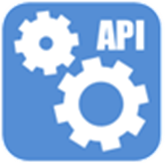

<link rel="stylesheet" type="text/css" media="all" href="../../Shared/Styling/Custom.css" />

# Produktinformation 

## Application Status API 

Application Status API är en programvara för att hämta status gällande olika typer av ansökningar. Modulen ingår i plattformen Tieto Education APIs.  
 
Alla API’er levereras med en SDK som innehåller teknisk dokumentation och informationskontrakt som levereras via GitHub, https://github.com/ExchangeServices   

Modulen finns för skolformerna förskola, grundskola och gymnasieskola. Modulen tillhandahåller status för följande typer av ansökningar:

- Val av inriktning
- Kurs- och ämnesval
- Skolval och skolbyte
- Val av förskola och fritids
- Modersmålsundervisning

 

### Informationsstruktur

Informationsstrukturen innehåller information rörande ansökningar.  

 

### Tekniska specifikationer 

Application Status API använder tekniken XML och HTTP för informationsutbytet. Tjänsterna är grupperade på skolform, filtreras på elev och kan även filtreras efter tidpunkt. 

 

## Dataspecifikationer 

Personattribut som används av samtliga ansökningar.

| Attribut | Beskrivning                                         | Exempel                                |
| ---------- | --------------------------------------------------- | -------------------------------------- |
| id         | Unik identifierare                                  | {17084b40-08f5-4bcd-a739-c0d08c176bad} |
| personid   | personnummer                                        | 19911201TF10                           |
| firstname  | Förnamn                                             | Nils                                   |
| middlename | Mellannamn                                          | Larsson                                |
| lastname   | Efternamn                                           | Persson                                |
| privacy    | <a href="#sekretesskydd">Sekretesskydd</a> för elev | level="2"                              |
 
 

Applikationsgemensamma attribut. Prefix för samtliga attribut är *application*.

| Attribut        | Beskrivning        | Exempel                                |
| --------------- | ------------------ | -------------------------------------- |
| id              | Unik identifierare | {17084b40-08f5-4bcd-a739-c0d08c176bad} |
| period          | Period             | 20/21                                  |
| applicationdate | Datum för ansökan  | 2021-01-01                             |
| startdate       | Startdatum         | 2021-01-01                             |
| enddate         | Slutdatum          | 2021-05-15                             |
| status          | Status för skolval, skolbyte och modersmålsval.    Alternativ för status är:    **Skolval och skolbyte**   - Utskickad   - Påbörjad   - Accepterad   - Avböjd   - Manuellt i inkorg   - Oense   - Flyttad till nya   - Sparad   - Maxpåminnelse ingen svarat   - Maxpåminnelse en svarat   - Hanterad    **Modersmålsval**   - Beviljad  - Kö  - Beviljas  - Avslås             | Hanterad  |
| unit            | Enhetsnamn         | Balderskolan                           |
| unitdomain      | Skolform           | Grundskola                             |

 

## Skolval och skolbyte

Skolval- och skolbytesspecificka attribut. Prefix för samtliga attribut är *schoolchoice*.

| Attribut      | Beskrivning        | Exempel                                |
| ------------- | ------------------ | -------------------------------------- |
| priority      | Prioritet          | 1                                      |
| id            | Unik identifierare | {17084b40-08f5-4bcd-a739-c0d08c176bad} |
| placementarea | Placeringsområde   | Östra                                  |
| unit          | Enhet              | Balderskolan                           |
| grade         | Årskurs            | Skolår 2                               |
| incomingdate  | Inkommandedatum    | 2021-01-01                             |

 

## Val av inriktning

Specifika attribut för val av inriktning. Prefix för samtliga attribut är *orientationchoice*.

| Attribut         | Beskrivning            | Exempel                                |
| ---------------- | ---------------------- | -------------------------------------- |
| educationplanid  | Id för utbildningsplan | {17084b40-08f5-4bcd-a739-c0d08c176bad} |
| educationplan    | Utbildningsplan        | TEPRO20                                |
| program          | Program                | TEPRO                                  |
| schoolyear       | Skolår                 | 4                                      |
| classperiod      | Period                 | 20/21                                  |
| classid          | Klassid                | {17084b40-08f5-4bcd-a739-c0d08c176bad} |
| classname        | Klassnamn              | TE20                                   |
| timeofchoice     | Valdatum               | 2021-01-01                             |
| comment          | Kommentar              | Kommentar                              |
| coursetypeid     | Kurstypsid             | INR                                    |
| coursetype       | Kurstyp                | Inriktningar                           |
| priority         | Prioritet              | 1                                      |
| status           | Status som kan vara:  - Ansökt  - Omval  - Placerad                 | Placerad                               |
| unitid           | Enhetsid               | {17084b40-08f5-4bcd-a739-c0d08c176bad} |
| unitname         | Enhetsnamn             | Balderskolan                           |
| studyselectionid | Id för val             | {17084b40-08f5-4bcd-a739-c0d08c176bad} |
| schooldomain     | Skolform               | GY                                     |
| receipt          | Kvittens               | 1                                      |

 

## Kursval

Kursvalsspecifika attribut. Prefix för samtliga attribut är *coursechoice*.

| Attribut                    | Beskrivning                         | Exempel                                          |
| --------------------------- | ----------------------------------- | ------------------------------------------------ |
| id                          | Kursid                              | {17084b40-08f5-4bcd-a739-c0d08c176bad}           |
| priority                    | Prioritet                           | 1                                                |
| typeofchoice                | Kurstyp                             | SPRAKVAL                                         |
| status                      | Status som kan vara:  - Ansökt  - Omval  - Placerad                              | Ansökt                                           |
| periodforclass              | Klassperiod                         | 20/21                                            |
| classid                     | Klassid                             | {17084b40-08f5-4bcd-a739-c0d08c176bad}           |
| classname                   | Klassnamn                           | TE19                                             |
| programcode                 | Programkod                          | AHADM                                            |
| schoolyear                  | Skolår                              | 3                                                |
| coursename                  | Kursnamn                            | Fysisk teater                                    |
| coursecode                  | Kurskod                             | TEAFYS0                                          |
| timeofchoice                | Valdatum                            | 2021-01-01                                       |
| startdate                   | Startdatum                          | 2021-01-01                                       |
| enddate                     | Slutdatum                           | 2022-01-01                                       |
| points                      | Poäng                               | 100                                              |
| unitdomainid                | Skolform                            | GY                                               |
| periodizededucationplanguid | Id för periodiserad utbildningsplan | {17084b40-08f5-4bcd-a739-c0d08c176bad}           |
| unitguid                    | Guid för enhet                      | {17084b40-08f5-4bcd-a739-c0d08c176bad}                                                |
| unitid                      | Enhetsid                            | ACAD                                             |
| unitname                    | Enhetsnamn                          | Balderskolan                                     |
| periodid                    | Periodsid                           | 20/21                                            |
| choiceperiodid              | Id för vald period                  | 20/21                                            |
| receipt                     | Kvittens                            | 1                                                |
| studyselectionguid          | Id för studieval                    | {17084b40-08f5-4bcd-a739-c0d08c176bad}                                                 |
| schedulegroups              | Schemagrupper                                    | Åk 3:2 |
| usplacementunitid           | Placeringsenhetsid                  | BLDR                                             |
| usplacementunitname         | Placeringsenhetsnamn                | Balderskolan                                     |

 

## Ämnesval

Ämnesvalsspecifika attribut. Prefix för samtliga attribut är *subjectchoice*.

| Attribut                | Beskrivning                          | Exempel                                                        |
 ----------------------- | ------------------------------------ | -------------------------------------------------------------- |
| id                      | Ämnesvalsid                              | {17084b40-08f5-4bcd-a739-c0d08c176bad}                         |
| alternative             | Alternativ                      |1                        |
| status                  | Status som kan vara:  - Ny  - Tilldelad     - Avvisad                               | Tilldelad |
| unitid                  | Enhetsid                             | 123                                                            |
| unitname                | Enhetsnamn                           | Balderskolan                                                   |
| unitdomainid            | Skolformsid                          | 123                                                            |
| unitdomainname          | Skolformsnamn                        | Grundskola                                                     |
| areaid                  | Områdesid                            | L3                                                             |
| periodid                | Periodsid                            | 123                                                            |
| period                  | Period                               | 20/21                                                          |
| startdate               | Startdatum                           | 2021-01-01                                                     |
| enddate                 | Slutdatum                            | 2021-06-01                                                     |
| schoolyear              | Skolår                               | 5                                                              |
| subjecttypeid           | Ämnestypsid                          | 123                                                            |
| subjecttypename         | Ämnestypsnamn                        | Elevens val                                                    |
| subjectid               | Ämnesid                              | 123                                                            |
| subjectname             | Ämnesnamn                            | Biologi                                                        |
| subjectabbreviation     | Ämnesförkortning                     | BI                                                             |
| guardiansubjectchoiceid | Id för vårdnadshavarens ansökan | {17084b40-08f5-4bcd-a739-c0d08c176bad}                         |

 

## Modersmål

Modersmålsundervisningsspecifika attribut. Prefix för samtliga attribut är *mothertongueeducation*.

| Attribut           | Beskrivning                                               | Exempel |
| ------------------ | --------------------------------------------------------- | ------- |
| subject            | Ämne                                                      | Spanska
| unitdomain            | Skolform                                             | Grundskola
| unitmanagerid      | Enhetschef personnummer | 19911201TF10                                             
| unitmanagername    | Enhetschefsnamn                                           | Karl Karlsson
| unitmanagerprivacy | <a href="#sekretesskydd">Sekretesskydd</a> för enhetschef | "level" = 2
| teacherid          | Lärare personnummer | 19911201TF10                                                   |
| teachername        | Lärarnamn                                                 | Karl Karlsson
| teacherprivacy     | <a href="#sekretesskydd">Sekretesskydd</a> för lärare    | "level" = 2

 

## Förskola och fritids

Förskola- och fritidsspecifika attribut. Prefix för samtliga attribut är *preschoolleisuretimecenter*.

| Attribut                                          | Beskrivning                                                               | Exempel                                                  |
| ------------------------------------------------- | ------------------------------------------------------------------------- | -------------------------------------------------------- |
| id                                                | Unikt id                                                                  | {17084b40-08f5-4bcd-a739-c0d08c176bad}                   |
| queuenumber                                       | Köplats                                                                   | 5                                                        |
| queuepriorityid                                   | PrioriteringsId                                                           | 123                                                      |
| queueprioritytext                                 | Kommentar till prioritering                                               | Uppehåll                                                 |
| prioritypoint                                     | Prioritetspoäng                                      | 98                                                       |
| prioritypointgroup1                               | Prioritetspoäng grupp 1                                      | 98                                                       |
| prioritypointgroup2                               | Prioritetspoäng grupp 2                                      | 98                                                       |
| prioritypointgroup3                               | Prioritetspoäng grupp 3                                      | 98                                                       |
| registereddate                                    | Datum för registrering                                                    | 2021-01-01                                               |
| queuedate                                         | Ködatum                                                                   | 2021-01-01                                               |
| placementrequestdate                              | Önskat datum                                                              | 2021-01-01                                               |
| passivequeue                                      | Passiv kö                                                                 | false                                                    |
| queueoptionid                                     | Kövalsid                                                                  | 123                                                      |
| areaid                                            | Områdesid                                                                 | L3                                                       |
| placementarea                                     | Placeringsområde                                                          | Östra                                                    |
| unitid                                            | Enhetsid                                                                  | 123                                                      | S |
| unitname                                          | Enhetsnamn                                                                | Balderskolan                                             |
| childminderid                                     | Dagbarnvårdare personnummer                                               | 19711201TF10                                             |
| childmindername                                   | Dagbarnvårdare namn                                                       | Karin Larsson                                            |
| managementid                                      | Regi                                                                      | 305                                                      |
| childactivitytype                                 | Verksamhetskod                                                            | 123456                                                   |
| hassiblingwithplacement                           | Har syskon med placering                                                  | true                                                     |
| hassiblingwithplacementinsamearea                 | Har syskon med placering i samma område                                   | true                                                     |
| youngestsiblingbirthdate                          | Födelsedatum för yngsta syskon                                            | 2015-01-01                                               |
| oldestsiblingbirthdate                            | Födelsetum för äldsta syskon                                              | 2015-01-01                                               |
| youngestsiblingsbirthdateplacementinsamearea      | Födelsedatum för yngsta syskon med placering i samma område               | 2015-01-01                                               |
| oldestsiblingsbirthdateplacementinsamearea        | Födelsedatum för äldsta syskon med placering i samma område               | 2015-01-01                                               |
| youngestsiblingsbirthdatequeueinsameunit          | Födelsedatum för yngsta syskon med köplats i samma enhet                  | 2015-01-01                                               |
| oldestsiblingsbirthdatequeueinsameunit            | Födelsedatum för äldsta syskon med köplats i samma enhet                  | 2015-01-01                                               |
| youngestsiblingsbirthdatequeueinsamearea          | Födelsedatum för yngsta syskon med köplats i samma område                 | 2015-01-01                                               |
| oldestsiblingsbirthdatequeueinsamearea            | Födelsedatum för äldsta syskon med köplats i samma område                 | 2015-01-01                                               |
| oldestsiblingsbirthdatequeueorplacementinsamearea | Födelsedatum för äldsta syskon med köplats eller placering i samma område | 2015-01-01                                               |
| oldestsiblingsbirthdatequeueorplacementinsameunit | Födelsedatum för äldsta syskon med köplats eller placering i samma enhet  | 2015-01-01                                               |
| hassiblinginqueue                                 | Har syskon i kö                                                           | true                                                     |
| guaranteedate                                     | Garantidatum                                                              | 2021-01-01                                               |
| hasplacement                                      | Har placering                                                             | true                                                     |
| hasplacementoffer                                 | Har placeringserbjudande                                                  | true                                                     |
| nativelanguagecode                                | Kod för första modersmål                                                  | DEU                                                      |
| othernativelanguagecode                           | Kod för andra modersmål                                                   | ARA                                                      |
| nativelanguage                                    | Första modersmål Tyska                                                    | Tyska                                                    |
| othernativelanguage                               | Andra modersmål                                                           | Arabiska                                                 |
| primaryadditionalinformationcode                  | Kod för utökad beskrivning                                                | 1234
| primaryadditionalinformationtext                  | Utökad beskrivning                                                        | Behov av särskilt stöd
| carehours                                         | Önskat antal timmar                                                       | 40.0                                                     |
| extenttext                                        | Beskrivning av omfattning                                                 | Beskrivande text                                         |
| placementtypeid                                   | Id för placeringstyp                                                      | 123                                                      |
| placementtype                                     | Placeeringstyp                                                            | Parallell placering                                      |
| withinapplicationdeadline                         | Inom tid för ansökan                                                      | true                                                     |
| guaranteemonth                                    | Om garantimånad används                                                   | true                                                     |
| anychildminderinthearea                           | Om dagbarnvårdare finns i området                                         | true                                                     |
| anyunitinthearea                                  | Om förskola eller fritids finns i området                                 | true                                                     |

 
 

## Sekretesskydd ## 
För sekretesskydd gäller följande värden på ”level”: 
 0 &emsp;&emsp; Ingen
 1 &emsp;&emsp; Skyddad adress 
 2 &emsp;&emsp; Skyddad folkbokföring 
 3 &emsp;&emsp; Både 1 och 2