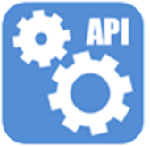

# Produktinformation #

## Application Status API ##

 

Application Status API är en programvara för att hämta status gällande olika typer av ansökningar. Modulen ingår i plattformen Tieto Education APIs.  
 
Alla API’er levereras med en SDK som innehåller teknisk dokumentation och informationskontrakt som levereras via GitHub, https://github.com/ExchangeServices   

 /> />
Modulen finns för skolformerna förskola, grundskola och gymnasieskola. Modulen tillhandahåller status för följande typer av ansökningar:

- Skolval
- Skolbyte
- Val av inriktning
- Kurs- och ämnesval
- Modersmålsundervisning
- Val av förskola och fritids

 

### Informationsstruktur ###

Informationsstrukturen innehåller rörande kalenderaktiviteter.  

 

### Tekniska specifikationer ### 

Application Status API använder tekniken XML och HTTP för informationsutbytet. Tjänsterna är grupperade på skolform, filtreras på elev och kan även filtreras efter tidpunkt. 

 

## Dataspecifikationer ##

Huvudattribut.

|Attribut       |Beskrivning        |Exempel
|-              |-                  |-
|id             |                   
|personid       |Id för eleven
|firstname      |Förnamn för elev
|middlename     |Mellannamn för elev
|lastname       |Efternamn för elev
|privacy        |Sekretesskydd för personen   Om personen är skyddad, gäller följande värden på ”level”:  1 &emsp;&emsp; Skyddad adress  2 &emsp;&emsp; Skyddad folkbokföring  3 &emsp;&emsp; Både 1 och 2 
|timestamp      |       
 
 

Applikationsgemensamma attribut. Prefix för samtliga attribut är *application*.

|Attribut                       |Beskrivning        |Exempel
|-                              |-                  |-
|id                             |                   |
|period                         |                   |
|applicationdate                | Datum för ansökan |
|startdate                      | Startdatum        |
|enddate                        | Slutdatum         |
|status                         | Status            |
|unit                           | Skola             |
|unitdomain                     | Skolform          |

 

Skolvalsspecificka attribut. Prefix för samtliga attribut är *schoolchoice*.

|Attribut                       |Beskrivning        |Exempel
|-                              |-                  |-
|priority                       | Prioritet         |
|id                             |                   |
|placementarea                  | Område            |
|unit                           | Skola             |
|grade                          |                   |
|incomingdate                   | Inkommandedatum   |

 
Skolbytesspecifika attribut. Prefix för samtliga attribut är *schoolexchange*?

 
Specifika attribut för val av inriktning. Prefix för samtliga attribut är *orientationchoice*.

|Attribut                       |Beskrivning        |Exempel
|-                              |-                  |-
|educationplanid                |                   |                
|educationplan                  |                   |
|program                        | Program           |
|schoolyear                     | Skolår            |
|classperiod                    |                   |
|classid                        |                   |
|classname                      | Namn på klass     |
|timeofchoice                   |                   |
|comment                        | Kommentar         |
|coursetypeid                   |                   |
|coursetype                     |                   |
|priority                       | Prioritet         |
|status                         | Status            |
|unitid                         | Id på skola       |
|unitname                       | Namn på skola     |
|studyselectionid               |                   |
|schooldomain                   | Skolform          |
|receipt                        |                   |

 
Kursvalsspecifika attribut. Prefix för samtliga attribut är *coursechoice*.

|Attribut                       |Beskrivning        |Exempel
|-                              |-                  |-
|id                             |                   |
|priority                       | Prioritet         |
|typeofchoice                   | Typ av val        |
|status                         | Status                  |
|periodforclass                 |                   |
|classid                        |                   |
|classname                      |                   |
|programcode                    |                   |
|schoolyear                     |                   |
|coursename                     |                   |
|coursecode                     |                   |
|coursepoints                   |                   |
|timeofchoice                   |                   |
|startdate                      |                   |
|enddate                        |                   |
|points                         |                   |
|unitdomainid                   |                   |
|periodizededucationplanguid    |                   |
|unitguid                       |                   |
|unitid                         |                   |
|unitmunicipalitycode           |                   |
|unitname                       |                   |
|periodid                       |                   |
|choiceperiodid                 |                   |
|receipt                        |                   |
|studyselectionguid             |                   |
|schedulegroups                 |                   |
|usplacementunitid              |                   |
|usplacementunitname            |                   |

 
Ämnesvalsspecifika attribut. Prefix för samtliga attribut är *subjectchoice*.

|Attribut                       |Beskrivning        |Exempel
|-                              |-                  |-
|id                             |                   |
|alternative                    |                   |
|status                         |                   |
|unitid                         |                   |
|unitname                       |                   |
|unitdomainid                   |                   |
|unitdomainname                 |                   |
|areaid                         |                   |
|periodid                       |                   |
|period                         |                   |
|startdate                      |                   |
|enddate                        |                   |
|schoolyear                     |                   |
|subjecttypeid                  |                   |
|subjecttypename                |                   |
|subjectid                      |                   |
|subjectname                    |                   |
|subjectabbreviation            |                   |
|guardiansubjectchoiceid        |                   |

 
Modersmålsundervisningsspecifika attribut. Prefix för samtliga attribut är *mothertongueeducation*.

|Attribut                       |Beskrivning        |Exempel
|-                              |-                                                          |-
|subject                        |                                                           |
|type                           |                                                           |
|unitmanagerid                  |                                                           |
|unitmanagername                |                                                           |
|unitmanagerprivacy             |                                                           |
|teacherid                      | Id på lärare                                              |
|teachername                    | Namn på lärare                                            |
|teacherprivacy                 | Sekretesskydd för läraren   Om läraren är skyddad, gäller följande värden på ”level”:  1 &emsp;&emsp; Skyddad adress  2 &emsp;&emsp; Skyddad folkbokföring  3 &emsp;&emsp; Både 1 och 2                               |

 
Förskola- och fritidsspecifika attribut. Prefix för samtliga attribut är *preschoolleisuretimecenter*.

|Attribut                                           |Beskrivning        |Exempel
|-                                                  |-                  |-
|id                                                 |                   |
|queuenumber                                        | Köplats           |
|queuepriorityid                                    |                   |
|queueprioritytext                                  |                   |
|prioritypoint                                      |                   |
|prioritypointgroup1                                |                   |
|prioritypointgroup2                                |                   |
|prioritypointgroup3                                |                   |
|registereddate                                     |                   |
|queuedate                                          |                   |
|placementrequestdate                               |                   |
|passivequeue                                       |                   |
|queueoptionid                                      |                   |
|areaid                                             |                   |
|placementarea                                      |                   |
|unitid                                             | Id på skola       |
|unitname                                           | Namn på skola     |
|childminderid                                      |                   |
|childmindername                                    |                   |
|managementid                                       |                   |
|childactivitytype                                  |                   |
|hassiblingwithplacement                            |                   |
|hassiblingwithplacementinsamearea                  |                   |
|youngestsiblingbirthdate                           |                   |
|oldestsiblingbirthdate                             |                   |
|youngestsiblingsbirthdateplacementinsamearea       |                   |
|oldestsiblingsbirthdateplacementinsamearea         |                   |
|youngestsiblingsbirthdatequeueinsameunit           |                   |
|oldestsiblingsbirthdatequeueinsameunit             |                   |
|youngestsiblingsbirthdatequeueinsamearea           |                   |
|oldestsiblingsbirthdatequeueinsamearea             |                   |
|oldestsiblingsbirthdatequeueorplacementinsamearea  |                   |
|oldestsiblingsbirthdatequeueorplacementinsameunit  |                   |
|hassiblinginqueue                                  |                   |
|guaranteedate                                      |                   |
|hasplacement                                       |                   |
|hasplacementoffer                                  |                   |
|nativelanguagecode                                 |                   |
|othernativelanguagecode                            |                   |
|nativelanguage                                     |                   |
|othernativelanguage                                |                   |
|primaryadditionalinformationcode                   |                   |
|primaryadditionalinformationtext                   |                   |
|carehours                                          |                   |
|extenttext                                         |                   |
|siblingswithplacement                              |                   |
|placementtypeid                                    |                   |
|placementtype                                      |                   |
|withinapplicationdeadline                          |                   |
|placementrequestdateformatinyearmonth              |                   |
|guaranteemonth                                     |                   |
|anychildminderinthearea                            |                   |
|anyunitinthearea                                   |                   |
|extrainformation                                   |                   |