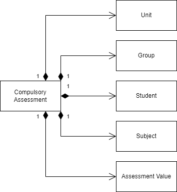

<div style = " float : left;" align = "left">
<left>

   **Tieto Education APIs**

Assessment API
</left>


</div>
 <div style = " float : right;" align = "right">


Version 1.0.0

2025-12-10

</div>


<div style = " margin-top : 500px;margin-bottom : 500px;" align = "center">

# Technical Specification API
## Assessment API  

</div>


[comment]: # (Page break)
<div style="page-break-after: always;"></div>
<div style = " margin-top : 100px;">

## Table of Contents

[1 Introduction](#1-introduction)

- [1.1 Prerequisites](#11-prerequisites)

- [1.2 Endpoints](#12-endpoints)

[2 Supported school types](#2-supported-school-types)

[3 Assessment Data Model](#3-assessment-data-model)

- [3.1 Domain model](#31-domain-model)

- [3.2 Entities](#32-entities)

  - [3.2.1 compulsoryassessment](#321-compulsoryschoolassessment)

  - [3.2.2 unit](#322-unit)

  - [3.2.3 group](#323-group)

  - [3.2.4 student](#324-student)

  - [3.2.5 subject](#325-subject)

  - [3.2.6 assessmentvalue](#326-assessmentvalue)

[4 Services](#4-services)

- [4.1 Get Compulsory School Assessments](#41-get-compulsory-school-assessments)

- [4.2 Get Compulsory School For Learning Disabilities Assessments](#42-get-compulsory-school-for-learning-disabilities-assessments)


[comment]: # (Page break)
<div style="page-break-after: always;"></div>
<div style = " margin-top : 100px;">

<div id ="introduction">

## **1 Introduction**

</div>

The Assessment API provides services that make it possible to retrieve student assessments

</div>


<div id ="prerequisites">

### 1.1 Prerequisites

Before you can get access to the Assessment API, you must request a License key from TietoEvry. You should have basic knowledge of the Swedish school system and W3C XML before you start using the API.


<br/>


<div style = "margin-bottom : 50px;">
</div>


<div id ="endpoints">

### 1.2 Endpoints

</div>

Assessment API is always hosted in Edlevo cloud environment. API url and path is: <br/>
https://utbintegration-education.service.tieto.com/PlanningAndFollowUp.Integration.Host/LES/Assessment/v1/Assessment/ <br>
for our test environment and: <br/> 
https://prodintegration-education.service.tieto.com/PlanningAndFollowUp.Integration.Host/LES/Assessment/v1/Assessment/ <br/>
for our production environment. 

<br/>

When calling a service, append the Service name to the appropriate path above, together with eventual query parameters, and your LicenseKey.


<div style = "margin-bottom : 50px;">
</div>

[comment]: # (Page break)
<div style="page-break-after: always;"></div>
<div style = " margin-top : 100px;">

<div id = "supported-school-types">

## 2 Supported school types

</div>

<br/>

Handles assessments for compulsory school and compulsory school with learning disability school.

</div>
<div style = "margin-bottom : 50px;">
</div>

[comment]: # (Page break)
<div style="page-break-after: always;"></div>
<div style = " margin-top : 100px;">

<div id = "application-api">

## 3 Assessment Data Model
</div>

<div id = "dm">

### 3.1 Domain model

</div>

This chapter describes the Assessment entities and their attributes.

<div style = "margin-top : 50px;">



</div>

<div id = "entities" style = "margin-top : 50px">

### 3.2 Entities

</div>

A note on the double identities given for units, groups, students and subjects:<br/>
- The identity named "id" refers to the GUID value given in Organization API.<br/>
- The identity named "uniqueid" refers to the unique identifier value given in SS12000 API.<br/>

<div id = "compulsoryschoolassessment">

#### 3.2.1 compulsoryschoolassessment

</div>

| Name            | Description                                                | Read-only |
|-----------------|------------------------------------------------------------|-----------|
| unit            | Unit entity (see 3.2.2)                                    | Yes       |
| group           | Group entity (see 3.2.3)                                   | Yes       |
| student         | Student entity (see 3.2.4)                                 | Yes       |
| subject         | Subject entity (see 3.2.5)                                 | Yes       |
| assessmentvalue | Assessment value entity (see 3.2.6)                        | Yes       |


<div id = "unit">

#### 3.2.2 unit

</div>

| Name     | Description                           | Read-only |
|----------|---------------------------------------|-----------|
| id       | Identifier for the unit (GUID)        | Yes       |
| uniqueid | Unique identifier for the unit        | Yes       |
| name     | Name of the unit                      | Yes       |


<div id = "group">

#### 3.2.3 group

</div>

| Name      | Description                          | Read-only |
|----------|---------------------------------------|-----------|
| id       | Identifier for the group (GUID)       | Yes       |
| uniqueid | Unique identifier for the group       | Yes       |
| name     | Name of the group for which student is placed and assessment is created | Yes       |


<div id = "student">

#### 3.2.4 student

</div>

| Name                   | Description                              | Read-only |
|------------------------|------------------------------------------|-----------|
| id                     | Identifier for the student (GUID)        | Yes       |
| uniqueid               | Unique identifier for the student        | Yes       |
| socialsecuritynumber   | Student's social security number         | Yes       |
| firstname              | Student's first name                     | Yes       |
| lastname               | Student's last name                      | Yes       |
| privacy                | Privacy protection level for the student | Yes       |


<div id = "subject">

#### 3.2.5 subject

</div>

| Name                | Description                              | Read-only |
|---------------------|------------------------------------------|-----------|
| id                  | Identifier for the subject (GUID)        | Yes       |
| uniqueid            | Unique identifier for the subject        | Yes       |
| name                | Full name of the subject                 | Yes       |
| code                | Subject code                             | Yes       |
| officialsubjectcode | Official Skolverket subject code         | Yes       |


<div id = "assessmentvalue">

#### 3.2.6 assessmentvalue

</div>

| Name            | Description                              | Read-only |
|-----------------|------------------------------------------|-----------|
| schoolYear      | The school year for the student          | Yes       |
| status          | Status of the assessment:<br/>- Draft<br/>- Ready<br/>- Withdrawn<br/>- Published. <br/>Assessment with 'New' status will not be returned | Yes       |
| assessmentlevel | The knowledge level :<br/>- None,<br/>- NotYet,<br/>- Meets,<br/>- Exceeds.  | Yes       |
| date            | Latest updated date. The latest assessment available at the specified date regardless of state from start of time. | Yes       |


[comment]: # (Page break)
<div style="page-break-after: always;"></div>
<div style ="margin-top : 100px">
</div>

<div id="services">

## 4 Services

</div>

All services are based on HTTP REST technology. "Get services" use the HTTP GET method.


<div id="get-compulsory-school-assessments-service">

### 4.1 Get Compulsory School Assessments

</div>

This service retrieves student assessments for compulsory school based on query parameters. 

**Service:**

| Service                        | Description                                  |
| ------------------------------ | -------------------------------------------- |
| GetCompulsorySchoolAssessments | Retrieves assessments for compulsory school students based on query parameters. |

**Query Parameters:**

| Name       | Description                 | Type    | Required | Format/Values                |
| ---------- | --------------------------- | ------- | -------- | ---------------------------- |
| startDate  | Start date for assessments in the range | string | Yes | YYYY-MM-DD             |
| endDate    | End date for assessments in the range | string   | No  | YYYY-MM-DD, Default: today's date |
| unitId     | Filter by specific unit     | string  | No       | see note below               |
| groupId    | Filter by specific group    | string  | No       | see note below               |
| studentId  | Filter by specific student  | string  | No       | see note below               |
| subjectId  | Filter by specific subject  | string  | No       | see note below               |
| schoolYear | Filter by school year       | integer | No       | value between 0 to 10        |
| status     | Filter by assessment status | string  | No       | Draft<br/>Ready<br/>Withdrawn<br/>Published |

**Note**

The value can either be a GUID value found in Organization API, or a unique identifier value found in SS12000.

**Return status and explanation:**

| HTTP Status Code | Description                | Returned value / explanation                |
| ---------------- | -------------------------- | ------------------------------------------- |
| 200              | Request succeeded.         | The assessments XML                         |
| 401              | Not authorized.            | API is not authenticated <br/> or <br/> API LicenseKey does not support this endpoint |
| 400              | Error in query parameters. | Validation error                            |
| 403              | Forbidden.                 | Not licensed to use this API                |
| 500              | Major fail.                | <Error message>                             |

**Example Response:**

```xml
<?xml version="1.0" encoding="utf-16"?>
<assessments xmlns:xsi="http://www.w3.org/2001/XMLSchema-instance" xmlns:xsd="http://www.w3.org/2001/XMLSchema" xmlns="http://open.tieto.com/edu/assessment/v1">
    <compulsoryschoolassessment>
        <unit>
            <id>{FD7F70F5-7743-4AD7-A28D-0B54B6B94C25}</id>
            <uniqueid>75f5414b-8c86-4b28-b428-862f018a73b5</uniqueid>
            <name>Mellanskolan</name>
        </unit>
        <group>
            <id>{E4578E5B-3098-4B53-B839-C9A415F4F93A}</id>
            <uniqueid>067553c2-7180-4ef4-b770-4edcb36defd5</uniqueid>
            <name>6A</name>
        </group>
        <student>
            <id>{51A095E1-FA83-421A-A95F-F38B12A7A9ED}</id>
            <uniqueid>ed3d267e-e917-4a1c-8fd6-8a4ba9443df3</uniqueid>
            <socialsecuritynumber>200101011234</socialsecuritynumber>
            <firstname>Anna</firstname>
            <lastname>Andersson</lastname>
            <privacy level="0">false</privacy>
        </student>
        <subject>
            <id>{875468AA-EE9C-4990-95C2-FDAED3D2379B}</id>
            <uniqueid>5cefc5c4-ce29-4fe3-b160-782a9dedbe99</uniqueid>
            <subjectname>Geografi</subjectname>
            <subjectcode>GE</subjectcode>
            <officialsubjectcode>GRGRGEO01</officialsubjectcode>
        </subject>
        <assessmentvalue>
            <date>2025-07-29</date>
            <schoolyear>6</schoolyear>
            <status>Draft</status>
            <assessmentlevel>Exceeds</assessmentlevel>
        </assessmentvalue>
    </compulsoryschoolassessment>
</assessments>
```

<div id="get-compulsory-school-for-learning-disabilities-assessments-service">

### 4.2 Get Compulsory School For Learning Disabilities Assessments

</div>

This service retrieves student assessments for compulsory school for learning disabilities based on query parameters. 

**Service:**

| Service                        | Description                                  |
| ------------------------------ | -------------------------------------------- |
| GetCompulsorySchoolForLearningDisabilitiesAssessments | Retrieves assessments for compulsory school for learning disabilities students based on query parameters. |

**Query Parameters:**

| Name       | Description                 | Type    | Required | Format/Values                |
| ---------- | --------------------------- | ------- | -------- | ---------------------------- |
| startDate  | Start date for assessments in the range | string | Yes | YYYY-MM-DD             |
| endDate    | End date for assessments in the range | string   | No  | YYYY-MM-DD, Default: today's date |
| unitId     | Filter by specific unit     | string  | No       | see note below               |
| groupId    | Filter by specific group    | string  | No       | see note below               |
| studentId  | Filter by specific student  | string  | No       | see note below               |
| subjectId  | Filter by specific subject  | string  | No       | see note below               |
| schoolYear | Filter by school year       | integer | No       | value between 0 to 10        |
| status     | Filter by assessment status | string  | No       | Draft<br/>Ready<br/>Withdrawn<br/>Published |

**Note**

The value can either be a GUID value found in Organization API, or a unique identifier value found in SS12000.

**Return status and explanation:**

| HTTP Status Code | Description                | Returned value / explanation                |
| ---------------- | -------------------------- | ------------------------------------------- |
| 200              | Request succeeded.         | The assessments XML                         |
| 401              | Not authorized.            | API is not authenticated <br/> or <br/> API LicenseKey does not support this endpoint |
| 400              | Error in query parameters. | Validation error                            |
| 403              | Forbidden.                 | Not licensed to use this API                |
| 500              | Major fail.                | Error message                             |

**Example Response:**

See GetCompulsorySchoolAssessments example response.

