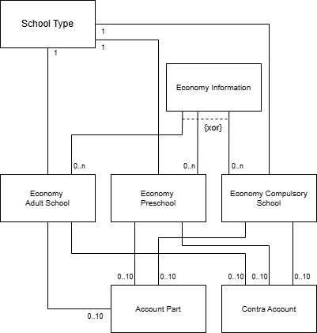

<left>

   **Edlevo APIs**

Economy API
</left>

 

Version 2.0

2026-01-20

# Technical Specification API
## Economy API

[comment]: # (Page break)

## **Table of Contents**

[**1 Introduction**](#introduction)

- [**1.1 Prerequisites**](#prerequisites)

- [**1.2 Endpoints**](#endpoints)

[**2 Supported school types**](#supported-school-types)

[**3 Economy Information Document**](#economy-information-document)

- [**3.1 Domain model**](#dm)

- [**3.2 Entities**](#entities)

  - [**3.2.1 economyinformation**](#informationdocument)

  - [**3.2.2 economyadultschool**](#adultschool-entity)

  - [**3.2.3 economypreschool**](#preschool-entity)

  - [**3.2.4 economycompulsoryschool**](#compulsoryschool-entity)

  - [**3.2.5 economyuppersecondaryschool**](#uppersecondaryschool-entity)

  - [**3.2.6 accountpart**](#accountpart-entity)

  - [**3.2.7 contraaccount**](#contraaccount-entity)

[**4 Services**](#services)

- [**4.1 Get Adult School Economy**](#get-adult-school-economy)

- [**4.2 Get Preschool Economy**](#get-pre-school-economy)

- [**4.3 Get Compulsory School Economy**](#get-compulsory-school-economy)

- [**4.4 Get Upper Secondary School Economy**](#get-upper-secondary-school-economy)

 

[comment]: # (Page break)

## **1 Introduction**

The Economy API provides services that:
- allows users to fetch adult school economy information. You can specify a start and end date to retrieve data. The data will have a start date on or after the given start date and an end date on or before the given end date. Alternatively, you can use a calculation date to fetch data that matches the provided calculation date. This is applicable for each corresponding adult school type.

- enables users to fetch preschool economy information for a specified year and month.

- enables users to fetch compulsory school economy information for a specified year and month. This is applicable for each corresponding compulsory school type.

- allows users to fetch upper secondary school economy information. You can specify a start and end date to retrieve data. The data will have a start date on or after the given start date and an end date on or before the given end date. Alternatively, you can use a calculation date to fetch data that matches the provided calculation date. This is applicable for each corresponding upper secondary school type.

The services in the Economy API are accessed via URIs.

This document describes the following:

- How the information elements are structured.

- The available services.

---

### **1.1 Prerequisites**

Before you can get access to the Economy API, you must request a license key from Tieto. You should have basic knowledge of the economic terms used in Edlevo, the Swedish school system and W3C XML before you start using the API.

 

### **1.2 Endpoints**

Base path for the sevices are:  
https://[host]/WE.Education.Integration.Host.Proxy/LES/Economy/v2/Economy  

 

To call a service, append the service name to the base path listed above, including any query parameters and your LicenseKey.

[comment]: # (Page break)

## 2 Supported school types

 

This API handles economy information for the following school types:
- Municipal adult school
- Education for adults with intellectual disabilities
- Swedish for immigrants school
- Higher vocational education school
- Preschool
- Compulsory school
- Compulsory school for learning disabilities
- Preschool class
- Upper secondary school
- Upper secondary school for learning disabilities

[comment]: # (Page break)

## 3 Economy Information Document

 ### **3.1 Domain model**

This chapter describes the Economy information document entities and their attributes.

### **3.2 Entities**

#### **3.2.1 economyinformation**

Attributes for economyinformation entity.

| Attribute | Description |
| --------- | ----------- |
| economyadultschool or   economypreschool or   economycompulsoryschool or   economyuppersecondaryschool | The adult school,  preschool,  compulsory school,  or upper secondary school data. |

 

#### **3.2.2 economyadultschool**

Attributes for economyadultschool entity

| Attribute | Description |
| --------- | ----------- |
| unitdomainid | The school domain or school type |
| unitname | The unit name |
| calculationtypecode | The calculation type code |
| pricelistcode | The price list code |
| calculationdate | The calculation date |
| unitid | The unit id |
| regard | The name of the created amount |
| pricecode | The price code |
| personid | The social security number of the student |
| name | The name of the student |
| programcode | The program code |
| groupid | The group id |
| coursecode | The course code |
| period | The study period |
| startdate | The start date |
| enddate | The end date |
| number | The number of points or hours |
| price | The price |
| amount | The amount |
| totalamount | The total amount |
| suppliernumber | The supplier number |
| accountpart | Accounts 1 to 10 |
| contraaccount | Contra accounts 1 to 10 |

 

#### **3.2.3 economypreschool**

Attributes for economypreschool entity

| Attribute | Description |
| --------- | ----------- |
| placementarea | The placement area code |
| livingarea | The living area code |
| unitname | The unit name |
| unitid | The unit id |
| personid | The social security number of the student |
| personfirstname | The first name of the student |
| personlastname | The last name of the student |
| schoolyear | The school year of the student |
| childactivitytype | The activity type |
| startdate | The start date |
| enddate | The end date |
| measurementdate | The measurement date |
| amountconcerns | The amount concerns code |
| amountconcernstext | The amount concerns text |
| integrationtimestamp | The integration timestamp |
| additionalreimbursement | Additional amount |
| managementid | The management id |
| calculationmonth | The calculation month, formatted as YYYYMM |
| primaryadditionalinformationcode | Additional information code |
| processtype | The process type |
| suppliernumber | The supplier number |
| accountgroup | The account group |
| unitdomaincode | The school domain code |
| amount | The amount |
| vat | The VAT |
| protectedaddress | Protected address |
| protectionlevel | The protection level |
| carehours | The care hours or OMF-hours |
| accountpart | Accounts 1 to 10 |
| contraaccount | Contra accounts 1 to 10 |

 

#### **3.2.4 economycompulsoryschool**

Attributes for economycompulsoryschool entity

| Attribute | Description |
| --------- | ----------- |
| placementarea | The placement area code |
| livingarea | The living area code |
| unitname | The unit name |
| unitid | The unit id |
| personid | The social security number of the student |
| personfirstname | The first name of the student |
| personlastname | The last name of the student |
| schoolyear | The school year of the student |
| childactivitytype | The activity type |
| startdate | The start date |
| enddate | The end date |
| measurementdate | The measurement date |
| amountconcerns | The amount concerns code |
| amountconcernstext | The amount concerns text |
| integrationtimestamp | The integration timestamp |
| additionalreimbursement | Additional amount |
| managementid | The management id |
| calculationmonth | The calculation month, formatted as YYYYMM |
| primaryadditionalinformationcode | Additional information code |
| processtype | The process type |
| suppliernumber | The supplier number |
| accountgroup | The account group |
| unitdomaincode | The school domain code |
| amount | The amount |
| vat | The VAT |
| protectedaddress | Protected address |
| protectionlevel | The protection level |
| accountpart | Accounts 1 to 10 |
| contraaccount | Contra accounts 1 to 10 |

 

#### **3.2.5 economyuppersecondaryschool**

Attributes for economyuppersecondaryschool entity

| Attribute | Description |
| --------- | ----------- |
| unitdomainid | The school domain or school type |
| unitname | The unit name |
| calculationtypecode | The calculation type code |
| pricelistcode | The price list code |
| calculationdate | The calculation date |
| unitid | The unit id |
| regard | The name of the created amount |
| pricecode | The price code |
| personid | The social security number of the student |
| name | The name of the student |
| programcode | The program code |
| groupid | The group id |
| coursecode | The course code |
| period | The study period |
| startdate | The start date |
| enddate | The end date |
| number | The number of points or hours |
| price | The price |
| amount | The amount |
| totalamount | The total amount |
| suppliernumber | The supplier number |
| accountpart | Accounts 1 to 10 |
| contraaccount | Contra accounts 1 to 10 |

 

#### **3.2.6 accountpart**

Attributes for accountpart entity

| Attribute | Description |
| --------- | ----------- |
| accountpart1 | Account part 1 |
| accountpart2 | Account part 2 |
| accountpart3 | Account part 3 |
| accountpart4 | Account part 4 |
| accountpart5 | Account part 5 |
| accountpart6 | Account part 6 |
| accountpart7 | Account part 7 |
| accountpart8 | Account part 8 |
| accountpart9 | Account part 9 |
| accountpart10 | Account part 10 |

 

#### **3.2.7 contraaccount**

Attributes for contraaccount entity

| Attribute | Description |
| --------- | ----------- |
| contraaccount1 | Contra account 1 |
| contraaccount2 | Contra account 2 |
| contraaccount3 | Contra account 3 |
| contraaccount4 | Contra account 4 |
| contraaccount5 | Contra account 5 |
| contraaccount6 | Contra account 6 |
| contraaccount7 | Contra account 7 |
| contraaccount8 | Contra account 8 |
| contraaccount9 | Contra account 9 |
| contraaccount10 | Contra account 10 |

 

[comment]: # (Page break)

## 4 Services

All services are based on HTTP REST technology. "Get services" are using the method HTTP GET.

 

### **4.1 Get Adult School Economy**

These services fetch economy information with either a start date and an end date or a calculation date for the corresponding adult school type. If start date and end date are used, the data fetched will have a start date on or after the given start date and an end date before or on the given end date. If calculation date is used, the data fetched will have a calculation date that matches the given calculation date.

**Query parameter:**

| Name | Description | Format |
| ---- | ----------- | ------
| StartDate | Get economy information with a start date of 'StartDate' or later. | YYYY-MM-DD, e.g. 2025-02-24 |
| EndDate | Get economy information with an end date of 'EndDate' or earlier. | YYYY-MM-DD, e.g. 2025-02-24 |
| CalculationDate | Get economy information with a calculation date of 'CalculationDate'. | YYYY-MM-DD, e.g. 2025-02-24 |

 

**Services:**

| Service| Description|
| ------ | ---------- |
| GetMunicipalAdultSchoolEconomy | Fetch economy information for adult municipal school   for the given input. |
| GetAdultSchoolForLearningDisabilitiesEconomy | Fetch economy information for adult school for learning   disabilities for the given input. |
| GetSwedishForImmigrantsSchoolEconomy | Fetch economy information for immigrants   for the given input. |
| GetHigherVocationalEducationEconomy | Fetch economy information for higher vocational education   for the given input. |

 

**Return status and explanation:**

| HTTP Status Code | Description | Returned text |
| ---------------- | ----------- | ------------- |
| 200 | Request succeeded. | The economyinformation xml |
| 403 | This feature is not permitted. | Not licensed to use current method |
| 403 | LicenseKey is missing or wrong. | HTTP Error 403 - Forbidden |
| 400 | Search date is missing or in wrong format. | Either start and end date or calculation date is required. |
| 500 | Major fail. | \<Error message> |

 

### **4.2 Get Preschool Economy**

This service fetch economy information with either a calculation month or an integration month. If calculation month is used, the data fetched will have a calculation month that matches the specified calculation month. If integration month is used, the data fetched will have an integration timestamp which is in the month of the specified integration month.
If both calculation month and integration month are specified, the data will have to match both criteria.

**Query parameter:**

| Name | Description | Format |
| ---- | ----------- | ------
| calculationMonth | Get economy information for the calculation   month given. | YYYYMM, e.g. 202502 |
| integrationMonth | Get economy information for the integration   month given. | YYYYMM, e.g. 202502 |

 

**Services:**

| Service| Description|
| ------ | ---------- |
| GetPreSchoolEconomy | Fetch economy information for the given calculation and/or integration month. |

 

**Return status and explanation:**

| HTTP Status Code | Description | Returned text |
| ---------------- | ----------- | ------------- |
| 200 | Request succeeded. | The economyinformation xml |
| 403 | This feature is not permitted. | Not licensed to use current method |
| 403 | LicenseKey is missing or wrong. | HTTP Error 403 - Forbidden |
| 400 | Calculation month is missing from query. | Calculation month is required |
| 500 | Major fail. | \<Error message> |

 

### **4.3 Get Compulsory School Economy**

This service fetch economy information with either a calculation month or an integration month. If calculation month is used, the data fetched will have a calculation month that matches the specified calculation month. If integration month is used, the data fetched will have an integration timestamp which is in the month of the specified integration month.
If both calculation month and integration month are specified, the data will have to match both criteria.

**Query parameter:**

| Name | Description | Format |
| ---- | ----------- | ------
| calculationMonth | Get economy information for the calculation   month given. | YYYYMM, e.g. 202502 |
| integrationMonth | Get economy information for the integration   month given. | YYYYMM, e.g. 202502 |

 

**Services:**

| Service| Description|
| ------ | ---------- |
| GetCompulsorySchoolEconomy | Fetch economy information for compulsory school   for the given calculation and/or integration month. |
| GetCompulsorySchoolForLearningDisabilitiesEconomy | Fetch economy information for compulsory school   for learning disabilities for the given calculation   and/or integration month. |
| GetPreSchoolClassEconomy | Fetch economy information for preschool class   for the given calculation and/or integration month. |

 

**Return status and explanation:**

| HTTP Status Code | Description | Returned text |
| ---------------- | ----------- | ------------- |
| 200 | Request succeeded. | The economyinformation xml |
| 403 | This feature is not permitted. | Not licensed to use current method |
| 403 | LicenseKey is missing or wrong. | HTTP Error 403 - Forbidden |
| 400 | Calculation month is missing from query. | Calculation month is required |
| 500 | Major fail. | \<Error message> |

 

### **4.4 Get Upper Secondary School Economy**

These services fetch economy information with either a start date and an end date or a calculation date for the corresponding upper secondary school type. If start date and end date are used, the data fetched will have a start date on or after the given start date and an end date before or on the given end date. If calculation date is used, the data fetched will have a calculation date that matches the given calculation date.

**Query parameter:**

| Name | Description | Format |
| ---- | ----------- | ------
| StartDate | Get economy information with a start date of 'StartDate' or later. | YYYY-MM-DD, e.g. 2025-02-24 |
| EndDate | Get economy information with an end date of 'EndDate' or earlier. | YYYY-MM-DD, e.g. 2025-02-24 |
| CalculationDate | Get economy information with a calculation date of 'CalculationDate'. | YYYY-MM-DD, e.g. 2025-02-24 |

 

**Services:**

| Service| Description|
| ------ | ---------- |
| GetUpperSecondarySchoolEconomy | Fetch economy information for upper secondary school for   the given input. |
| GetUpperSecondarySchoolForLearningDisabilitiesEconomy | Fetch economy information for upper secondary school for   learning disabilities for the given input. |

 

**Return status and explanation:**

| HTTP Status Code | Description | Returned text |
| ---------------- | ----------- | ------------- |
| 200 | Request succeeded. | The economyinformation xml |
| 403 | This feature is not permitted. | Not licensed to use current method |
| 403 | LicenseKey is missing or wrong. | HTTP Error 403 - Forbidden |
| 400 | Search date is missing or in wrong format. | Either start and end date or calculation date is required. |
| 500 | Major fail. | \<Error message> |

 
