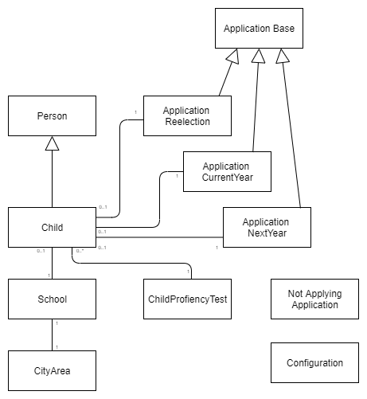

<left>

   **Tieto Education APIs**

School Search API
</left>

 

Version 1.0.0

2021-11-04

# Technical Specification API
## School Search API  

---
---

[comment]: # (Page break)

## **Table of Contents**

[**1 Introduction**](#introduction)

- [**1.1 Prerequisites**](#prerequisites) 

[**2 Supported school types**](#supported-school-types)

[**3 School Search API**](#school-search-api)

- [**3.1 Domain model**](#dm) 

- [**3.2 Entities**](#entities)
  
  -   [**3.2.1 Configuration**](#configuration)
  -   [**3.2.2 City area**](#cityarea)
  -   [**3.2.3 School**](#school)
  -   [**3.2.4 Person**](#person)
  -   [**3.2.5 Child**](#child)
  -   [**3.2.6 Application Base**](#applicationbase)
  -   [**3.2.7 Next Year Application**](#applicationnextyear)
  -   [**3.2.8 Proficiency Test**](#childproficiencytest)
  -   [**3.2.9 Signature**](#signature)
  -   [**3.2.10 Not applying application**](#applicationnotapplying)
  -   [**3.2.11 Return value**](#return-value)
     
[**4 Services**](#services)

- [**4.1 Configuration Service**](#config-service) 

- [**4.2 Person Services**](#person-service) 

- [**4.3 Unit Services**](#unit-service) 

- [**4.4 Read Application Services**](#read-application-services) 

- [**4.5 Save Application Services**](#save-application-services) 

   

---
---

[comment]: # (Page break)

## **1 Introduction**

The School Search API provides services that makes it possible to show and update school choice and school change information residing in Tieto Education, in an external client. The service in the School Search API are accessed via URIs. Each service has a unique URI.

This document describes the following:

- Which school search information that user can get via the School Search API.
- Which school search information that user can update via the School Search API.
- How the information elements are structured

---

### **1.1 Prerequisites**

Before you can get access tot he School Search API, you must request a license key from TietoEvry. You should have basic knowlege on Swedish school system and W3C XML before you start using the API.

 

---
---

[comment]: # (Page break)

## 2 Supported school types

 

This API handles school choice and school change for Compulsory School.

---
---

[comment]: # (Page break)

## 3 School Search

 ### **3.1 Domain model**

 

This chapter describe the School Search entities and their attributes.

### **3.2 Entities**

#### **3.2.1 Configuration** 

Attributes for configuration attributes.

| Name                               | Description                             | Read-only |
| ---------------------------------- | --------------------------------------- | --------- |
| currentyearcutoffdate              | Transition date for current school year | Y         |
| currentyeardataupdate              | Return date for current school year     | Y         |
| currentyearapplicationson          | Current year applications activated     | Y         |
| reelectionapplicationson           | Backup applications activated           | Y         |
| birthyearforpreschoolclasschildren | Birth year for preschool class          | Y         |

 

#### **3.2.2 City area** 

Attributes for a city area.

| Name      | Description         | Read-only |
| --------- | ------------------- | --------- |
| areaid    | City Area Id        | Y         |
| areaname  | Name of City Area   | Y         |

 

#### **3.2.3 School** 

Attributes for a school.

| Name                   | Description                        | Read-only |
| ---------------------- | ---------------------------------- | --------- |
| schoolid               | School Id                          | Y         |
| schoolname             | School name                        | Y         |
| schooltypeid           | School type                        | Y         |
| isprofileschool        | Indicates that the school has a profile | Y    |
| profilename            | Profile name                       | Y         |
| grade                  | List of applicable grades          | Y         |
| isschoolusingoursystem | Indicates that the school is part of the registered schools | Y |
| cityarea               | City area where the school resides | Y         |
| proficiencytestid      | Id of associated proficiency test  | Y         |

 

#### **3.2.4 Person**

Attributes for a person

| Name               | Description                           | Read-only |
| ------------------ | ------------------------------------- | --------- |
| ssn                | Social Security Number                | Y         |
| firstname          | First name                            | Y         |
| lastname           | Last name                             | Y         |
| streetaddress      | Street address                        | Y         |
| zipcode            | Zip code                              | Y         |
| postalarea         | Postal area                           | Y         |
| carofaddress       | Care of address                       | Y         |
| protectedidentity  | Protected identity                    | Y         |
| notinmunicipality  | Living outside Stockholm municipality | Y         |

 

#### **3.2.5 Child** 

Attributes for a child.

| Name                           | Description                    | Read-only |
| ------------------------------ | ------------------------------ | --------- |
| applicationnextyear            | Application for next year      | Y         |
| applicationcurrentyear         | Application for current year   | Y         |
| applicationreelection          | Reelection application         | Y         |
| currentschool                  | Current school placement       | Y         |
| currentgrade                   | Current grade                  | Y         |
| hasappliedtonextyear           | Indicates if a next year application exists | Y |
| hasappliedtocurrentyear        | Indicates if a current year application exists | Y |
| hasappliedtoreelection         | Indicates if a reelection application exists | Y |
| existsindatabase               | Indicates if the student exists in the student registry | Y |
| childproficiencytest           | List of the student's proficiency tests | Y |
| notapplying                    | Indicates if the student is not applying | Y |
| notappliedtonextyearreason     | The reason for not applying    | Y         |
| notappliedtonextyearreasontext | Text describing the reason for not applying | Y |
| legalguardiancount             | Number of guardians            | Y         |

 

#### **3.2.6 Application Base**

Attributes valid for all three types of applications. The application for next year has additional attributes (see <a href="applicationnextyear">3.2.7</a>).

| Name                        | Description                         | Read-only |
| --------------------------- | ----------------------------------- | --------- |
| childssn                    | Social Security Number of the child | Y         |
| applicationid               | Id of the application               | Y         |
| confirmationemail           | e-mail to the applying guardian     | N         |
| applicationtype             | Type of application                 | Y         |
| legalguardian1signedssn     | Social Security Number of the applying guardian | Y |
| wantssiblingpriorityschool1 | Sibling priority for first school choice | Y    |
| wantssiblingpriorityschool2 | Sibling priority for second school choice | Y   |
| wantssiblingpriorityschool3 | Sibling priority for third school choice | Y    |
| phonenumber                 | Mobile number to the guardian       | N         |
| phonenumberissecret         | Indicates that the mobile number is secret | Y  |
| altphonenumber              | Alternative number to the guardian  | Y         |
| altphonenumberissecret      | Indicates that the alternative number is secret | Y |
| updatedby                   | Updated by                          | Y         |
| updatedat                   | Time of update                      | Y         |
| createdat                   | Time of creation                    | Y         |
| lastupdated                 | Not Used                            | Y         |
| createdby                   | Created by                          | Y         |
| firstschoolchoice           | Id of first chosen school           | N         |
| secondschoolchoice          | Id of second chosen school          | N         |
| thirdschoolchoice           | Id of third chosen school           | N         |
| guaranteeschoolchoice       | Id of attendance school choice      | Y         |
| firstschoolstatus           | Status of first chosen school       | Y         |
| firstschoolname             | Name of first chosen school         | Y         |
| firstschoolnamewithgrades   | Name of first chosen school with available grade | Y |
| firstschoolprofilename      | Name of profile of first chosen school | N      |
| secondschoolstatus          | Status of second chosen school      | Y         |
| secondschoolname            | Name of second chosen school        | Y         |
| secondschoolnamewithgrades  | Name of second chosen school with available grade | Y |
| secondschoolprofilename     | Name of profile of second chosen school | N     |
| thirdschoolstatus           | Status of third chosen school       | Y         |
| thirdschoolname             | Name of third chosen school         | Y         |
| thirdschoolnamewithgrades   | Name of third chosen school with available grade | Y |
| thirdschoolprofilename      |  Name of profile of third chosen school | N     |
| guaranteeschoolstatus       | Status of attendance school         | Y         |
| guaranteeschoolname         | Name of attendance school           | Y         |
| guaranteeschoolnamewithgrades | Name of attendance school with available grade | Y |
| searchedgrade               | Applied school year                 | Y         |

 

#### **3.2.7 Next Year Application**

The additional attributes for a next year application.

| Name                        | Description                         | Read-only |
| --------------------------- | ----------------------------------- | --------- |
| notapplying                 | Indicates if the student is not applying | Y    |
| notappliedreasonid          | The reason for not applying         | Y         |
| notappliedtreason           | Text describing the reason for not applying | Y |
| hasappliedtootherschools    | Indicates that the student has applied to another school | Y |
| otherschoolname             | Not Used                            | Y         |
| wantssiblingpriorityschool4 | Sibling priority for fourth school choice | Y   |
| wantssiblingpriorityschool5 | Sibling priority for fifth school choice | Y    |
| fourthschoolchoice          | Id of fourth chosen school          | N         |
| fifthschoolchoice           | Id of fifth chosen school           | N         |
| fourthschoolstatus          | Status of fourth chosen school      | Y         |
| fourthschoolname            | Name of fourth chosen school        | Y         |
| fourthschoolnamewithgrades  | Name of fourth chosen school with available grade | Y |
| fifthschoolstatus           | Status of fifth chosen school       | Y         |
| fifthschoolname             | Name of fifth chosen school         | Y         |
| fifthschoolnamewithgrades   | Name of fifth chosen school with available grade | Y |

 

#### **3.2.8 Proficiency Test**

The attributes for a proficiency test.

| Name               | Description                         | Read-only |
| ------------------ | ----------------------------------- | --------- |
| childssn           | Social Security Number of the child | Y         |
| proficiencytestid  | Id of the proficiency test          | Y         |
| priorityorder      | Priority order of the test          | Y         |

 

#### **3.2.9 Signature**

The attributes for a signature.

| Name               | Description                            | Read-only |
| ------------------ | -------------------------------------- | --------- |
| childssn           | Social Security Number of the child    | Y         |
| legalguardianssn   | Social Security Number of the guardian | Y         |
| legalguardianphonenumber | Telephone number of the guardian | Y         |
| acceptsschooloffer | Indicates if the offer is accepted     | N         |
| signaturephrase    | Signature phrase                       | N         |
| signedat           | Time for signing                       | N         |
| otherschoolname    | Not used                               | Y         |
| otherschoolphonenumber | Not used                           | Y         |
| keepplaceinqueue   | Not used                               | Y         |
| applicationid      | Id of application                      | Y         |
| numberoflegalguardians | Number of guardians to the child   | Y         |

 

#### **3.2.10 Not applying application**

The attributes for a non-applying application.

| Name               | Description                            | Read-only |
| ------------------ | -------------------------------------- | --------- |
| childid            | Social Security Number of the child    | Y         |
| reason             | Status of reason                       | N         |
| reasontext         | Additional reason text                 | N         |
| createdby          | Social Security Number of the child's guardian | N |

 

#### **3.2.11 Return value**

The attributes for return values.

| Name               | Description                                 | Read-only |
| ------------------ | ------------------------------------------- | --------- |
| status             | Status of the call                          | Y         |
| errormessage       | List of error messages, if status is ERROR  | Y         |

 

---
---

[comment]: # (Page break)

## 4 Services

All services are based on HTTP REST technology. "Get services" are using the method HTTP GET. "Update services" are using the method HTTP POST.

 

### **4.1 Configuration Service**

This service return the configuration values set in the student registry

**Services :**

| Service| Description|
| ------ | ---------- |
|GetConfiguration| Returns configuration settings.|
---
 

### **4.2 Person Services**

These services return person information from different perspectives

**Parameters :**

This parameter is valid for all services.

| Parameter  | Mandatory  | Description                                      |
| ---------- | ---------- | ------------------------------------------------ |
| ssn        | Yes        | Social Security Number of the person of interest |

**Services :**

| Service      | Description                                            |
| ------------ | ------------------------------------------------------ |
| GetPerson    | Returns person information for the input `ssn`.        |
| GetGuardians | Returns person information for the guardians to  `ssn`.|
| GetChildren  | Returns person information for the children to `ssn`.  |
---

 

### **4.3 Unit Services**

These services return information related to units relevant to school choice.

**Parameters :**

| Parameter       | Mandatory  | Description                  |
| --------------- | ---------- | ---------------------------- |
| applicationType | Yes        | One of the Application Types |
| schoolId        | Yes        | The Id of the school         |

**Services :**

| Service      | Description                                            |
| ------------ | ------------------------------------------------------ |
| GetAreas     | Returns all areas.                                     |
| GetSchools   | Returns all schools related to  `applicationType`.     |
| GetSchoolTextAdmission | Returns specific admission text for the school `schoolId` and related to `applicationType`.|
---

 

### **4.4 Read Application Services**

These services return information related to applications.

**Parameters :**

| Parameters      | Mandatory  | Description                 |
| --------------- | ---------- | --------------------------- |
| applicationId   | Yes        | The Id of the Application   |
| child           | Yes        | The Social Security Number of the child |

**Services :**

| Service                       | Description                              |
| ----------------------------- | ---------------------------------------- |
| GetChildWithApplication       | Returns `child`'s info with applications. |
| GetAcceptanceLetterPdf        | Returns Acceptance Letter in pdf format for a specific `applicationId`. |
| GetAcceptanceLetterSignatures | Returns Acceptance Letter Signatures for a specific  `applicationId`. |
---

 

### **4.5 Save Application Services**

These services save applications and related information.

**Services :**

| Service                       | Description                                     |
| ----------------------------- | ----------------------------------------------- |
| SaveApplicationNextYear       | Saves an application for next year.             |
| SaveApplicationReelection     | Saves an application for reelection.            |
| SaveApplicationCurrentYear    | Saves an application for current year.          |
| SaveNotApplying               | Saves a not applying application for next year. |
| SaveAcceptanceLetterSignature | Saves a signature.                              |
---
---
